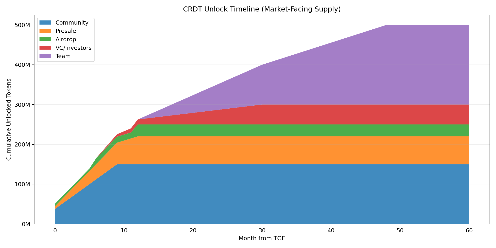
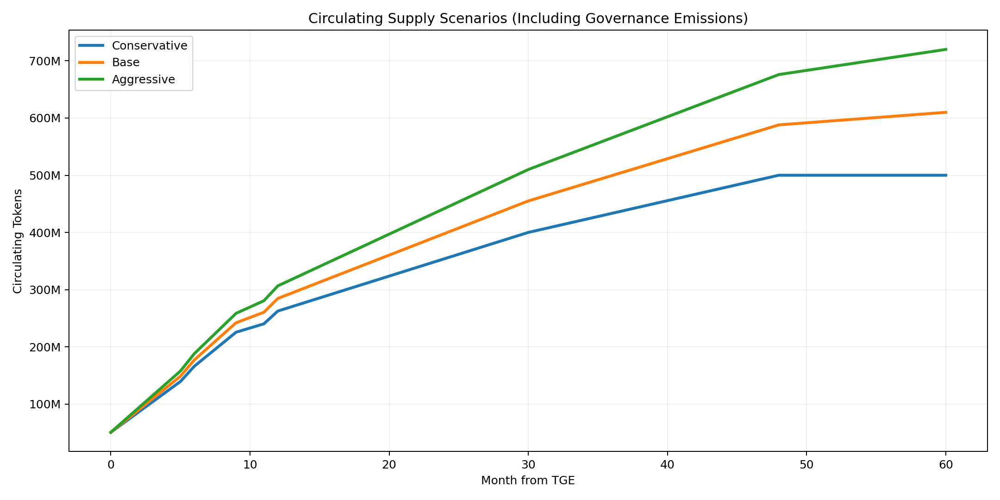
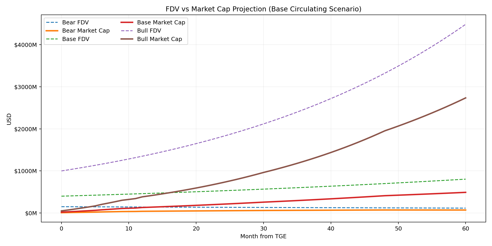
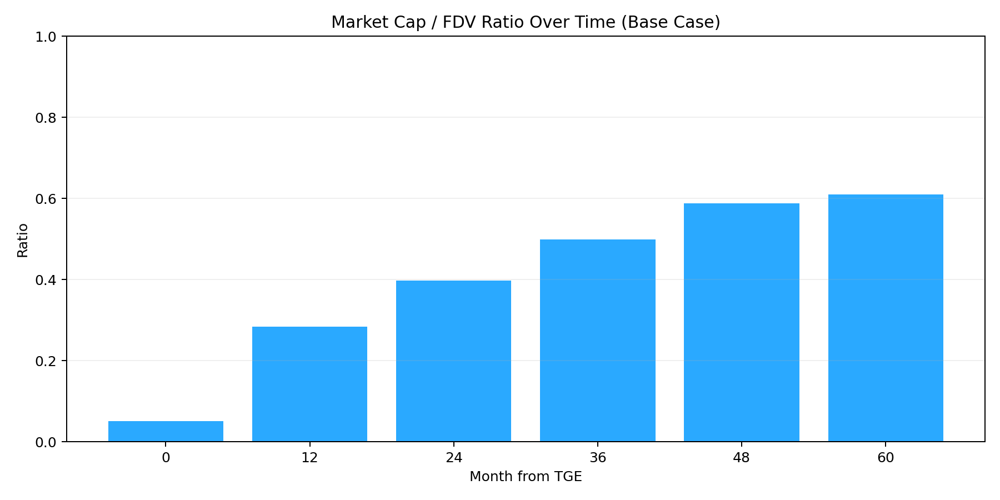
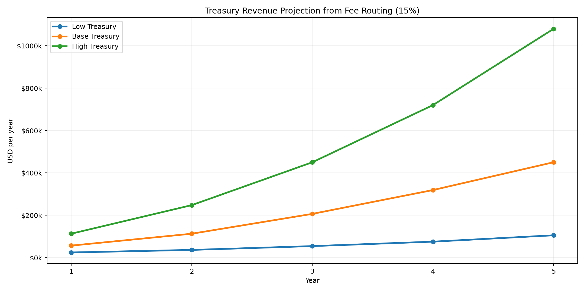

# Personal Tokenomics Playbook (Private)

This is a private analysis document for internal planning and decision support.
It is intentionally not linked from public docs navigation.

## What This Pack Includes

- A reproducible model script: `scripts/tokenomics_personal_model.py`
- Generated charts: `docs/private/tokenomics/images/`
- Backing data tables: `docs/private/tokenomics/data/`
- Interactive local graph tool: `docs/private/tokenomics/live_tokenomics_calculator.html`
- This narrative explainer with assumptions, interpretations, and planning notes

## 1) Full Tokenomics Understanding (At a Glance)

### Fixed Supply and Allocation

- Total supply is fixed at `1,000,000,000 CRDT` (no inflation in Phase 1).
- Allocation is:
  - Treasury: `30%`
  - Team: `20%`
  - Protocol liquidity reserve: `20%`
  - Community sale: `15%`
  - Presale: `7%`
  - VC/investors: `5%`
  - Airdrop: `3%`

### Unlock and Emission Design

- Immediate + short-term float: community sale, presale, and airdrop.
- Medium-term float: VC unlock after cliff.
- Long-term float: team unlock after longer cliff.
- Governance-controlled overhang: treasury and liquidity reserve emissions.

This means the headline supply (`1B`) is not the same as tradable/circulating supply.
That gap is what drives the difference between FDV and market cap over time.

## 2) Timeline Graphs and Effects

### Unlock Timeline (Market-Facing Supply)

What it tells you:
- Large jump in circulating pressure happens in year 1 from sale + presale + airdrop.
- Team/VC unlocks extend the supply increase into years 2-4.
- Market-facing unlock reaches about `500M` by month 48 in this model.

### Circulating Supply Scenarios (with Governance Emissions)

Model scenarios:
- Conservative: no treasury/liquidity emissions.
- Base: treasury emits 20% of its bucket over 5 years, liquidity reserve emits 25%.
- Aggressive: treasury emits 40%, liquidity reserve emits 50%.

Base case checkpoints:
- Month 0: `50.5M` circulating
- Month 12: `284.5M`
- Month 24: `398.2M`
- Month 36: `499.3M`
- Month 48: `588.0M`
- Month 60: `610.0M`

## 3) FDV, Market Cap, and Valuation Effects

### FDV vs Market Cap Paths

Key formulas:
- `FDV = token_price * 1,000,000,000`
- `Market Cap = token_price * circulating_supply`
- `MC/FDV ratio = circulating_supply / total_supply`

### MC/FDV Ratio (Base Scenario)

Interpretation:
- Early stage ratio is low, so FDV can look large relative to tradable value.
- As unlocks and emissions progress, market cap converges toward FDV.
- This ratio should be tracked as a core valuation quality metric.

## 4) Explain `Value Capture and Fee Routing` (Docs lines 46-52)

Source policy says protocol fee revenue is routed:
- `80%` to lenders
- `15%` to treasury
- `5%` to safety module/insurance

Operational meaning:
- **Lenders (80%)**: primary incentive to keep liquidity in pools and maintain depth.
- **Treasury (15%)**: protocol operating surplus (runway, grants, buybacks if approved, growth).
- **Safety module (5%)**: risk buffer to absorb bad debt and improve protocol durability.

If `F` is total annual protocol fee revenue:
- Lenders receive `0.80 * F`
- Treasury receives `0.15 * F`
- Safety module receives `0.05 * F`

Example:
- If annual protocol fee revenue is `$3.0M`, then:
  - Lenders: `$2.4M`
  - Treasury: `$450k`
  - Safety: `$150k`

## 5) How We Make Profit (Private Operator View)

Profit depends on *your role*:

### A) Protocol/Treasury Level (direct protocol economics)

- Main direct capture is treasury share of fees (`15%` of protocol fee revenue).
- Secondary capture can include governance-approved treasury strategies (deployments, buybacks, grants with ROI).
- Safety module reserves reduce tail-risk losses that would otherwise impair treasury value.

### B) Token Holder Level (indirect equity-like exposure)

- Value can accrue if:
  - protocol usage grows,
  - governance allocates treasury efficiently,
  - circulating expansion is paced relative to demand,
  - market prices in stronger fee durability.
- This is not guaranteed cash flow to every holder unless governance designs direct distribution mechanisms.

### C) Contributor/Investor Level

- Returns come from entry valuation vs future market cap/liquidity depth.
- Timing risk is high around major unlock windows.
- Risk-adjusted outcome is improved by tracking MC/FDV, liquidity, and fee growth together.

## 6) Fee Projections and Value Projections

### Treasury Fee Projection (from routing rule)

Scenario assumptions:
- Low: average loan book grows from `$8M` to `$35M`, protocol fee APR `2.0%`
- Base: `$15M` to `$120M`, fee APR `2.5%`
- High: `$25M` to `$240M`, fee APR `3.0%`

Resulting treasury annual revenue (15% share):
- Low: Year 1 `$24k` -> Year 5 `$105k` (5Y cumulative `$294k`)
- Base: Year 1 `$56k` -> Year 5 `$450k` (5Y cumulative `$1.14M`)
- High: Year 1 `$112k` -> Year 5 `$1.08M` (5Y cumulative `$2.61M`)

### What This Implies for Value

- Early years are mainly a **growth valuation** story, not a high-cash-flow story.
- To support higher token valuation, we need:
  - stronger loan book scale,
  - stable fee take,
  - predictable risk outcomes (low impairment),
  - credible treasury capital allocation.

## 7) Practical Planning Metrics You Should Track Monthly

- Circulating supply and unlocked-over-next-90-days
- MC/FDV ratio
- Average loan book and utilization
- Gross protocol fees and treasury fee capture
- Bad debt / impairment rate
- Net treasury runway in months

## 8) Assumptions Used in This Private Model

- Airdrop modeled as staged windows: 20% at TGE, 30% at month 6, 50% at month 12.
- Treasury and liquidity reserve emissions are scenario-based assumptions (policy-controlled).
- Valuation scenarios use synthetic price paths (bear/base/bull), not price predictions.
- Fee scenarios are planning models for sensitivity analysis, not forecasts.

## 9) Regenerate and Edit

Rebuild charts/data after changing assumptions:

- `python3 scripts/tokenomics_personal_model.py`

Output paths:
- `docs/private/tokenomics/images/`
- `docs/private/tokenomics/data/`

Open the interactive calculator locally:
- Open `docs/private/tokenomics/live_tokenomics_calculator.html` in your browser.
- Adjust price/emission/fee assumptions and read updated FDV, market cap, and routing outputs live.

---

Not financial advice. This is an internal planning model.
