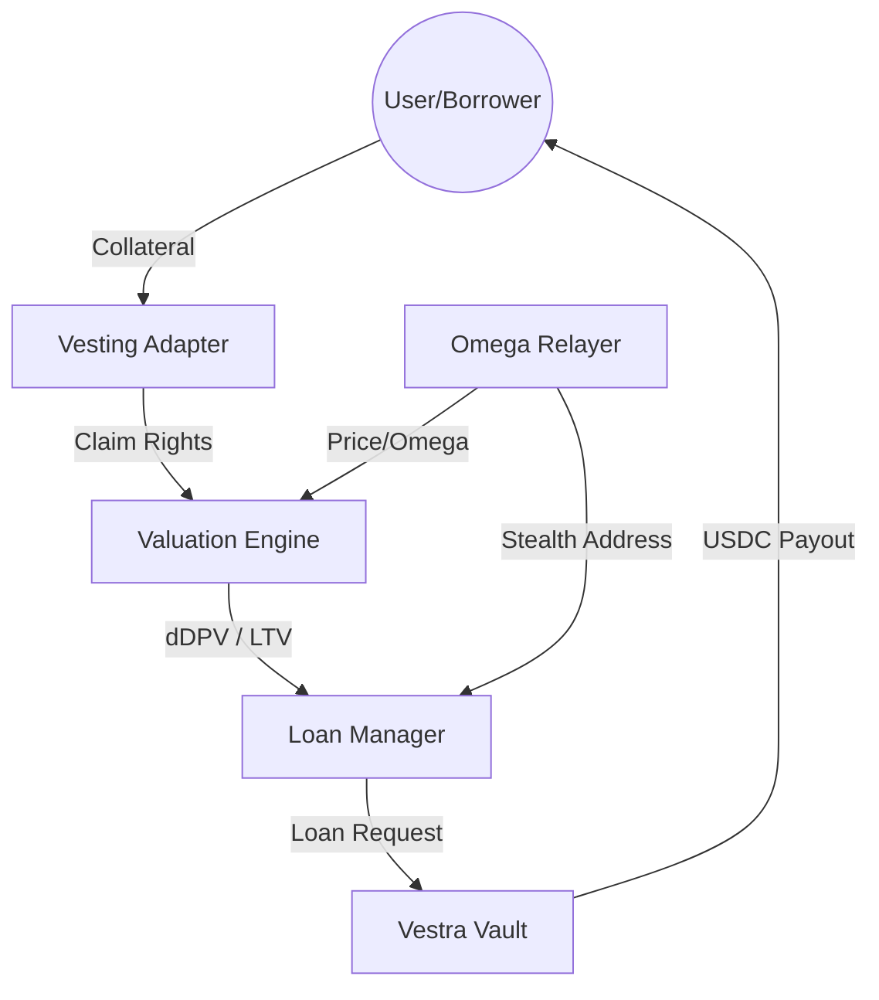

# Architecture: Modules & Data Flow

The Vestra Protocol architecture is a modular, high-integrity system designed for the safe issuance of credit against time-locked digital assets.

## Core Modules

### 1. Valuation Engine (`ValuationEngine.sol`)
The heart of the protocol. It calculates the **Discounted Present Value (dDPV)** using real-time price feeds, historical volatility, and the Omega AI Watcher multiplier.
- **Inputs**: Oracle price, time to unlock, volatility index, Omega multiplier.
- **Outputs**: dDPV in stablecoins.

### 2. Loan Manager (`LoanManager.sol`)
Handles the entire lifecycle of a loan, from origination to liquidation.
- **Functions**: `createLoan`, `repayLoan`, `togglePrivacy`, `triggerLiquidation`.
- **Enforcement**: Interfaces with the `VestingAdapter` to secure claim rights.

### 3. Vesting Adapter (`VestingAdapter.sol`)
Provides an abstraction layer for various vesting standards (Sablier, Streamflow, Custom NFT Wrappers). It ensures Vestra can "attach" to any time-locked collateral.

### 4. Vault (`VestraVault.sol`)
Stores the stablecoin liquidity provided by Lenders.
- **Revenue Logic**: Collects origination fees and interest spreads for $CRDT holders.

## Data Flow Diagram (Mermaid)

## Enforcement Mechanism
Unlike traditional lending where the protocol liquidates early based on LTV drops, Vestra "locks" the liquidation potential to the unlock event. If the loan remains unpaid at the moment the tokens become transferable, the protocol executes its **Staged Auction** or **Strategic Recourse**.
